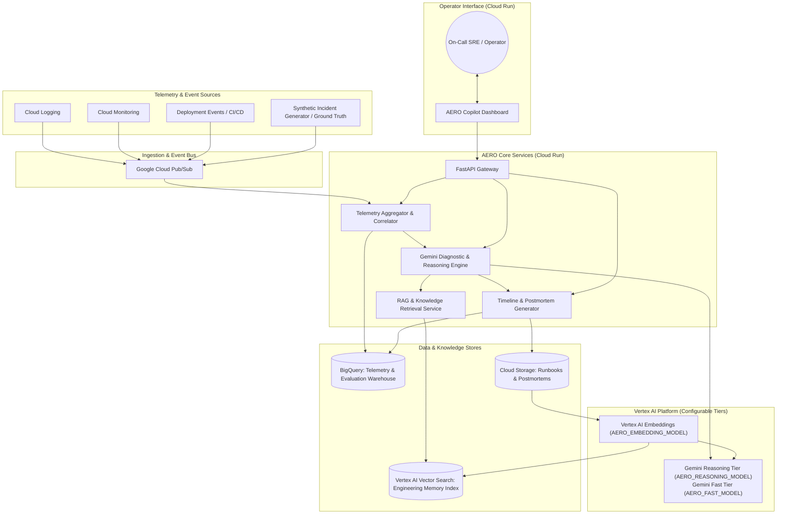
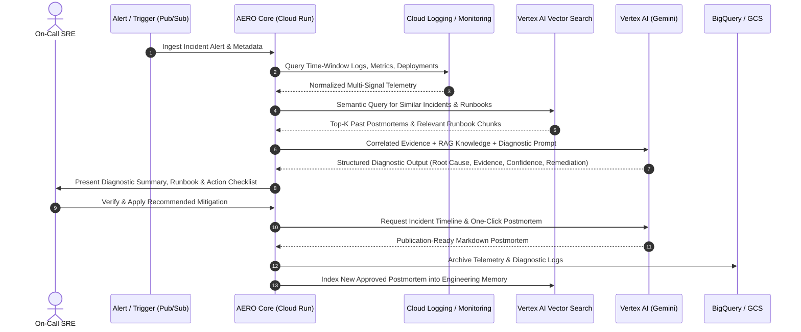

# AERO Technical Architecture

**System Name:** AERO (AI-Enabled Reliability & Operations)  
**Document Type:** System Architecture Document (SAD)  
**Program:** Google Patchamomma 2026   

---

## 1. Architectural Vision & Principles

AERO is an intelligent, cloud-native Site Reliability Engineering (SRE) copilot built natively on Google Cloud. It transforms chaotic, multi-source telemetry into clear, evidence-backed diagnostic insights and actionable remediation plans.

### Core Architectural Principles
1. **Multi-Signal Evidence Correlation over Raw Log Dumps:** Simple "send logs to LLM" architectures fail in production because raw logs lack causal structure, exceed token limits, and miss metric anomalies or deployment triggers. AERO ingests, correlates, and structures logs, metrics, deployment events, and health signals before applying AI reasoning.
2. **Grounded Engineering Memory (RAG):** Context is king. By integrating operational runbooks and past postmortems via Vertex AI Vector Search, AERO grounds all recommendations in proven institutional knowledge.
3. **Human-in-the-Loop Safety:** AERO acts strictly as an advisory copilot. Remediation plans are clear, step-by-step proposals with dry-run commands and rollback instructions. AERO does not perform autonomous production writes.
4. **Serverless & Cost-Conscious:** Leveraging managed Google Cloud serverless services (Cloud Run, Pub/Sub, BigQuery, Vertex AI) enables instantaneous scaling, high availability, zero idle costs, and low maintenance overhead.

---

## 2. Google Cloud Services & Responsibilities

| Google Cloud Service | Role in AERO | Key Responsibilities |
| :--- | :--- | :--- |
| **Cloud Run** | Application Hosting | Hosts the AERO FastAPI backend API and the SRE Copilot Frontend UI in containerized, scale-to-zero serverless environments. |
| **Cloud Logging** | Telemetry Source (Logs) | Provides structured application, system, and audit logs. Serves as a filterable log stream for incident time-window extraction. |
| **Cloud Monitoring** | Telemetry Source (Metrics & Alerts) | Tracks Golden Signals (Latency, Traffic, Errors, Saturation), resource metrics (CPU, Memory, IO), and delivers alert triggers. |
| **Pub/Sub** | Asynchronous Event Bus | Decouples alert ingestion, async telemetry indexing, and background postmortem processing pipelines. |
| **BigQuery** | Telemetry Warehouse & Benchmark Analytics | Stores structured historical incident telemetry, log analytics, performance metrics, and evaluation benchmark results. |
| **Cloud Storage (GCS)** | Knowledge & Artifact Store | Stores raw runbook documents, historical postmortem archives (Markdown/PDF), diagnostic snapshots, and generated reports. |
| **Vertex AI / Gemini** | Multimodal Reasoning Engine | Performs structured causal reasoning, multi-signal correlation, timeline generation, postmortem authoring, and SRE chat reasoning via configurable model endpoints (`AERO_REASONING_MODEL` / `AERO_FAST_MODEL`). |
| **Vertex AI Vector Search** | Semantic Retrieval Engine | Hosts dense vector index for Engineering Memory using configurable Vertex AI embeddings (`AERO_EMBEDDING_MODEL`); enables sub-second semantic retrieval of similar historical RCAs and runbooks. |

---

## 3. High-Level Architecture Diagram



---

## 4. End-to-End Data Flow & Pipelines



---

## 5. Detailed Component Breakdown

### 5.1 Telemetry Aggregator & Correlator
- **Time-Window Slicing:** Extracts $T_{-15\text{min}}$ to $T_{+5\text{min}}$ relative to the incident trigger.
- **Multi-Signal Alignment:** Normalizes logs, metric timeseries (Golden Signals), and deployment metadata onto a shared timestamp axis.
- **Log Noise Reduction:** Deduplicates repetitive stack traces, isolates error level logs (`ERROR`, `FATAL`, `CRITICAL`), and computes log frequency anomaly spikes.
- **Deployment Correlation:** Matches active incident times with recent container rollouts, config updates, or environment variable modifications.

### 5.2 RAG-Powered Engineering Memory
- **Knowledge Ingestion Pipeline:**
  - Loads Markdown/PDF runbooks and postmortems from Cloud Storage.
  - Chunks documents semantically (preserving headings, root-cause sections, and mitigation tables).
  - Generates dense vector embeddings using configurable Vertex AI text embeddings (`AERO_EMBEDDING_MODEL`).
  - Upserts vectors into Vertex AI Vector Search with metadata (service name, failure category, severity).
- **Retrieval Pipeline:**
  - Converts the current incident's log error signatures and metric anomaly summaries into a search query.
  - Queries Vector Search using approximate nearest neighbor (ANN) retrieval.
  - Returns top-$k$ relevant historical incident summaries and exact runbook execution snippets.

### 5.3 Multi-Modal Gemini Reasoning Engine
- **Why Not Simple Log Dumps?**
  Raw logs do not explain *causality*. AERO builds a structured context payload containing:
  1. System Topology & Affected Services
  2. Metric Anomalies (e.g., Memory ramp, connection pool depletion, latency p99 spike)
  3. Filtered Error Log Samples with frequency distribution
  4. Recent Deployment and Configuration Diffs
  5. Retrieved Engineering Memory (Past Postmortems & Runbooks)
- **Engine Capabilities:**
  - Causal inference: Distinguishes trigger (e.g., unindexed query) from symptom (e.g., DB thread exhaustion $\rightarrow$ HTTP 504 gateway timeout) using the Gemini Reasoning Tier (`AERO_REASONING_MODEL`).
  - Fast telemetry filtering and chat response using the Gemini Fast Tier (`AERO_FAST_MODEL`).
  - Confidence calculation: Assigns High, Medium, or Low confidence based on evidence convergence.
  - Evidence citation: Every assertion links directly to an exact timestamped log or metric trace.

### 5.4 Remediation & Verification Engine (Human-in-the-Loop)
- Formulates a prescriptive remediation plan:
  - Immediate mitigation steps (e.g., rollback deployment to `v1.2.3`, increase replica count, scale connection pool).
  - Verification commands to ensure service health recovery.
  - Rollback commands if the mitigation fails.
- All actions are presented in the UI as interactive checklists for operator execution.

### 5.5 Timeline & Postmortem Generator
- **Chronological Synthesis:** Parses logs and telemetry to identify:
  - $T_0$: First anomaly onset
  - $T_{\text{alert}}$: Alert notification fired
  - $T_{\text{detect}}$: SRE triage commenced
  - $T_{\text{mitigate}}$: Remediation applied
  - $T_{\text{resolve}}$: Metrics return to baseline
- **Postmortem Synthesis:** Outputs standard Google SRE postmortem format with Five-Whys analysis, impact breakdown, and preventative action items using Gemini.
- **Continuous Feedback:** Approved postmortems are automatically exported to GCS and re-indexed into Engineering Memory.

---

## 6. AI Output Specifications & Structured Schemas

All Gemini outputs conform to strict JSON schemas to guarantee deterministic rendering in the SRE Copilot UI.

### 6.1 Diagnostic Output Schema (`AeroDiagnosticReport`)
```json
{
  "incident_id": "INC-20260830-001",
  "service_name": "payment-service",
  "severity": "CRITICAL",
  "incident_summary": "Payment service experiencing 98% HTTP 504 timeouts caused by database connection pool starvation following release v2.4.1.",
  "probable_root_cause": {
    "title": "Database Connection Pool Exhaustion",
    "description": "Release v2.4.1 introduced an unindexed query in checkout transaction handler, holding connections open for >15s until HikariCP pool (max: 20) was exhausted.",
    "category": "CONFIGURATION_DATABASE",
    "trigger_event": "Deployment of payment-service:v2.4.1 at 19:42 UTC"
  },
  "confidence_level": {
    "score": 0.94,
    "rating": "HIGH",
    "rationale": "Direct correlation between deployment timestamp, HikariCP timeout logs, and PostgreSQL active connection saturation metrics."
  },
  "supporting_evidence": [
    {
      "signal_type": "LOG",
      "timestamp": "2026-08-30T19:44:12Z",
      "source": "payment-service-pod-7b9f",
      "content": "ConnectionTimeoutException: Connection is not available, request timed out after 30000ms"
    },
    {
      "signal_type": "METRIC",
      "timestamp": "2026-08-30T19:43:00Z",
      "metric_name": "database/pool/active_connections",
      "observation": "Active connections spiked from 4 to 20 (100% saturation)"
    },
    {
      "signal_type": "DEPLOYMENT",
      "timestamp": "2026-08-30T19:42:15Z",
      "change": "Deployed image gcr.io/aero-prod/payment-service:v2.4.1"
    }
  ],
  "similar_historical_incidents": [
    {
      "incident_id": "INC-20251112-089",
      "title": "Order Service DB Pool Starvation",
      "similarity_score": 0.91,
      "resolution_summary": "Rolled back release and increased connection pool max size from 20 to 50."
    }
  ],
  "recommended_remediation": {
    "immediate_steps": [
      "Rollback payment-service to previous stable tag v2.4.0",
      "Restart payment-service pods to release blocked connection threads"
    ],
    "dry_run_command": "gcloud run services update payment-service --image gcr.io/aero-prod/payment-service:v2.4.0 --dry-run",
    "verification_metric": "Check database/pool/active_connections drops below 10 and HTTP 504 error rate drops to 0%",
    "rollback_plan": "If rollback fails to stabilize, temporarily scale Cloud SQL instance to db-custom-8-32768"
  },
  "relevant_runbook": {
    "title": "Payment Service Database Triage Runbook",
    "document_uri": "gs://aero-runbooks/payment-db-triage.md",
    "pertinent_section": "Section 4.2: Connection Pool Exhaustion Recovery"
  }
}
```

---

## 7. Security, Isolation & Safety Architecture

1. **Human-in-the-Loop Isolation:** AERO’s Cloud Run service account has strictly **read-only** telemetry access to Cloud Logging, Cloud Monitoring, and BigQuery. It has **no permission** to execute deployment modifications or cluster mutations directly.
2. **PII and Secret Masking:** The Ingestion pipeline passes raw log payloads through a high-speed regex sanitization layer that scrubs authorization tokens, Bearer headers, passwords, credit card numbers, and IP addresses prior to vectorization or Gemini prompt assembly.
3. **Data Residency:** All data, embeddings, and model invocations reside within the configured Google Cloud project boundary (`us-central1` or specified region) ensuring compliance with enterprise governance.
4. **Least-Privilege IAM:** 
   - `roles/logging.viewer` (Read logs)
   - `roles/monitoring.viewer` (Read metrics)
   - `roles/aiplatform.user` (Invoke Vertex AI models & vector search)
   - `roles/bigquery.dataEditor` (Read/write telemetry & benchmark records)
   - `roles/storage.objectViewer` (Read runbooks from GCS)

---

## 8. Summary of Data Flow Mappings

| Pillar | Input Data Sources | Google Cloud Pipeline | Model / Tool | Output Artifact |
| :--- | :--- | :--- | :--- | :--- |
| **1. Understand** | Logs, Metrics, Deploys, Alerts | Cloud Logging, Cloud Monitoring, Pub/Sub $\rightarrow$ Aggregator | Gemini Reasoning / Fast Tiers | Structured Diagnostic Report & Confidence Score |
| **2. Remember** | Runbooks, Past RCAs, Postmortems | GCS $\rightarrow$ Embedding Pipeline $\rightarrow$ Vertex AI Vector Search | Vertex AI Embeddings + Gemini | Retrieved Similar Incidents & Relevant Playbooks |
| **3. Document** | Correlated Timestamps, SRE Actions | Aggregator $\rightarrow$ Timeline Generator $\rightarrow$ GCS / BigQuery | Gemini Reasoning Tier | Chronological Timeline, Replay & Markdown Postmortem |
| **4. Prevent** (Stretch) | Git Diffs, K8s Manifests, Terraform | CI/CD Trigger $\rightarrow$ Risk Scorer $\rightarrow$ Vector Memory Check | Gemini Reasoning Tier | Pre-Deployment Risk Score & Preventative Warnings |
