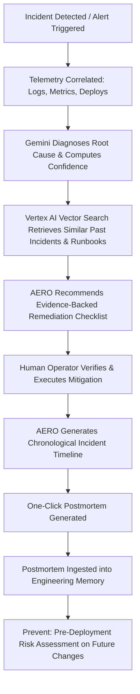

# AERO Product Requirements Document (PRD)

**Project Name:** AERO (AI-Enabled Reliability & Operations)  
**Tagline:** AI-Powered Cloud Reliability Copilot  
**Program:** Google Patchamomma 2026  
**Status:** Approved Blueprint  
**Target Milestone:** MVP Checkpoint (September 5, 2026)  

---

## 1. Executive Summary

AERO is an AI-powered Cloud Reliability Copilot built on Google Cloud and Gemini. It empowers Site Reliability Engineers (SREs), DevOps teams, and on-call developers to **detect, diagnose, resolve, and prevent** production incidents in cloud-native applications.

Modern distributed architectures generate overwhelming volumes of telemetry across microservices. During high-severity incidents, engineers suffer from cognitive overload, fragmented institutional knowledge, and slow manual postmortem authoring. AERO solves this by correlating telemetry across multiple signals, querying an institutional "Engineering Memory" via Retrieval-Augmented Generation (RAG), delivering evidence-backed remediation recommendations, synthesizing instant incident timelines, and assessing pre-deployment risk.

```
+-----------------------------------------------------------------------------------+
|                                 AERO COPILOT                                      |
+-----------------------------------------------------------------------------------+
|  1. UNDERSTAND       |  2. REMEMBER         |  3. DOCUMENT         |  4. PREVENT   |
|  Telemetry & Root    |  RAG-Powered         |  Incident Replay &   |  Deployment   |
|  Cause Analysis      |  Engineering Memory  |  Auto-Postmortem     |  Risk Advisor |
+-----------------------------------------------------------------------------------+
```

---

## 2. Problem Statement

1. **Telemetry Overload & Signal Fragmentation:** During an outage, on-call engineers are bombarded with thousands of log lines, metric spikes across microservices, and alert storms. Finding the needle in the haystack takes 70%+ of the Mean Time to Resolve (MTTR).
2. **Loss of Institutional Knowledge:** Past postmortems, Root Cause Analysis (RCA) documents, and runbooks are scattered across wikis, Google Docs, and issue trackers. When a known issue reoccurs, on-call engineers often troubleshoot from scratch rather than leveraging past solutions.
3. **High Cognitive Load Under Pressure:** Triage requires manual correlation of recent code deployments, configuration changes, upstream service health, and metric anomalies.
4. **Laborious Post-Incident Documentation:** Assembling chronological incident timelines and authoring thorough postmortems takes hours of manual log digging after resolution.
5. **Recurring Failure Modes:** Engineering teams deploy similar architectural or configuration mistakes repeatedly because there is no automated bridge between past incident postmortems and new release pipelines.

---

## 3. Target Personas & Users

| Persona | Primary Goal | Pain Point Addressed |
| :--- | :--- | :--- |
| **Site Reliability Engineer (SRE)** | Maintain 99.99% system availability, minimize MTTR, automate toil. | Rapidly correlates complex cross-service anomalies with zero noise. |
| **On-Call Software Engineer** | Quickly stabilize services during 2 AM pages without deep knowledge of every microservice. | Provides step-by-step verified runbooks and past incident playbooks. |
| **Incident Commander (IC)** | Coordinate triage, understand impact, and communicate timeline updates. | Generates real-time incident summaries and chronological timelines. |
| **Engineering Leader / VP** | Prevent repeated outages, track operational health, foster blameless culture. | Automates comprehensive postmortems and highlights recurring failure risks. |

---

## 4. The Four Product Pillars

### Pillar 1: Understand (Incident Analysis & Root-Cause Detection)
- Ingests and correlates multi-source signals: structured logs, metric anomalies, deployment events, and service health checks.
- Applies Gemini reasoning to separate root cause from downstream cascading symptoms.
- Emits a structured diagnostic report with confidence scores and exact telemetry citations.

### Pillar 2: Remember (Engineering Memory via RAG)
- Indexes historical postmortems, RCAs, architecture docs, and operational runbooks into a semantic vector store.
- During an active incident, retrieves the top matching historical incidents and relevant runbook procedures.
- Synthesizes prior mitigation tactics to provide context-aware recommendations.

### Pillar 3: Document (Incident Timeline, Replay & Automated Postmortem)
- Constructs a precise chronological incident timeline from correlated telemetry timestamps and operator actions.
- Provides an incident replay capability to inspect system state step-by-step.
- Generates a complete, publication-ready postmortem (Markdown / Google Docs format) including root cause, timeline, five-whys analysis, and preventive action items with a single click.

### Pillar 4: Prevent (Deployment Risk Assessment — Stretch Capability)
- Evaluates proposed code commits, configuration manifests, and infrastructure changes against historical failure patterns.
- Alerts developers to high-risk patterns (e.g., missing timeouts, unindexed queries, replica misconfigurations) before production deployment.

---

## 5. Primary User Journey



1. **Incident Trigger:** Cloud Monitoring alert fires or an on-call engineer opens an incident in AERO.
2. **Telemetry Ingestion:** AERO pulls the relevant time window of logs, metric anomalies, and deployment events across affected services.
3. **Root Cause Analysis:** Gemini analyzes the correlated evidence and isolates the likely root cause with a confidence score.
4. **Memory Retrieval:** Vector Search retrieves semantically similar historical postmortems and specific runbook sections.
5. **Remediation Recommendation:** AERO presents a step-by-step remediation plan with citations to evidence and runbooks.
6. **Human Verification:** The operator reviews and executes the mitigation (human-in-the-loop).
7. **Timeline Generation:** AERO automatically constructs the incident event sequence from start to resolution.
8. **Postmortem Export:** A complete postmortem is generated, reviewed, and exported.
9. **Continuous Learning:** The approved postmortem is embedded into the Engineering Memory vector store.
10. **Proactive Prevention:** Future deployments are checked against known failure modes.

---

## 6. Functional Requirements

### FR-1: Telemetry Ingestion & Multi-Signal Correlation
- **FR-1.1:** Support ingestion of Cloud Logging structured entries, Cloud Monitoring metric series, and deployment metadata.
- **FR-1.2:** Normalize telemetry from disparate microservices into a unified incident time-window context.
- **FR-1.3:** Filter noise and group related alert cascades into a single incident entity.

### FR-2: AI Diagnostic Engine
- **FR-2.1:** Analyze multi-signal telemetry to infer the primary root cause.
- **FR-2.2:** Output a clear natural language summary, probable root cause, evidence citations, and confidence level (High/Medium/Low).
- **FR-2.3:** Require strict evidence citation: every claim must map to specific log records, metric anomalies, or deployment events.

### FR-3: RAG-Powered Engineering Memory
- **FR-3.1:** Ingest unstructured markdown, PDF, and text postmortems and runbooks from Cloud Storage.
- **FR-3.2:** Generate semantic embeddings and maintain a vector index in Vertex AI Vector Search.
- **FR-3.3:** Retrieve top-$k$ relevant past incidents and operational runbooks during live triage.
- **FR-3.4:** Inject retrieved historical context into the prompt for grounding.

### FR-4: Human-in-the-Loop Remediation Advisory
- **FR-4.1:** Formulate clear, step-by-step remediation suggestions with expected impact and rollback steps.
- **FR-4.2:** **Crucial Constraint:** AERO provides recommendations only; it does NOT execute autonomous destructive production changes.
- **FR-4.3:** Allow operators to provide feedback (Accept / Reject / Edit) on recommendations to calibrate future responses.

### FR-5: Automated Incident Timeline & Postmortem Generation
- **FR-5.1:** Automatically compile timestamped events (first anomaly, alert trigger, triage start, mitigation applied, recovery).
- **FR-5.2:** Generate standard postmortems conforming to Google SRE best practices (Summary, Impact, Root Cause, Trigger, Resolution, 5-Whys, Timeline, Action Items).
- **FR-5.3:** Allow 1-click export to Markdown and structured JSON.

### FR-6: SRE Copilot Interactive Dashboard
- **FR-6.1:** Web-based interface hosted on Cloud Run.
- **FR-6.2:** Real-time multi-panel view: Incident Overview, Correlated Telemetry, AI Diagnosis, Retrieved Knowledge, Actionable Remediation, and Postmortem Editor.
- **FR-6.3:** Interactive AI chat allowing on-call engineers to ask follow-up questions regarding the active incident.

### FR-7: Deployment Risk Advisor (Stretch / Phase 4)
- **FR-7.1:** Accept deployment manifests and commit diffs as input.
- **FR-7.2:** Compare change attributes against historical failure patterns in Engineering Memory.
- **FR-7.3:** Output a deployment risk score (0-100) with identified risk factors and suggested checks.

---

## 7. Non-Functional Requirements

| Category | Requirement | Target Metric |
| :--- | :--- | :--- |
| **Latency** | End-to-end diagnostic inference time | $\le 10\text{ seconds}$ |
| **Vector Retrieval** | Engineering memory semantic lookup | $\le 500\text{ ms}$ |
| **Availability** | Web UI and API uptime | $\ge 99.9\%$ (Serverless auto-recovery) |
| **Cost Efficiency** | Hackathon tier operation | Zero-idle cost via Cloud Run and on-demand serverless tools |
| **Security** | Least privilege access & data privacy | Cloud IAM, PII masking, no credentials logged or transmitted |
| **Fidelity** | Hallucination rate on synthetic benchmark | $< 2\%$ unsupported claims |
| **Maintainability** | Clean separation of telemetry vs. knowledge | Modular microservice-ready architecture |

---

## 8. Success Criteria & Evaluation Metrics

1. **Diagnostic Accuracy:** $\ge 85\%$ accuracy in identifying the correct root cause on the synthetic incident benchmark suite.
2. **Evidence Completeness:** $100\%$ of diagnostic claims supported by cited log entries or metric anomalies.
3. **Time to Postmortem:** Postmortem draft generated in $< 15\text{ seconds}$ versus traditional $1\text{ to }3\text{ hours}$ manual compilation.
4. **Usability & Operator Trust:** Clear confidence scoring and human-in-the-loop verification on all remediation steps.
5. **Google Cloud Alignment:** Flawless demonstration leveraging Gemini on Vertex AI, Vector Search, Cloud Run, Cloud Logging, Cloud Monitoring, BigQuery, Pub/Sub, and Cloud Storage.
